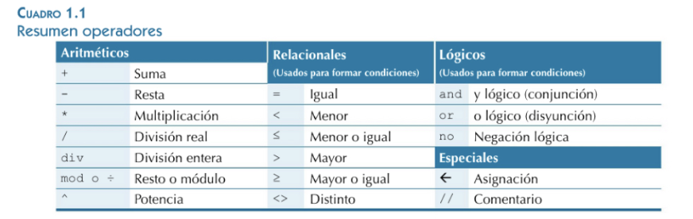
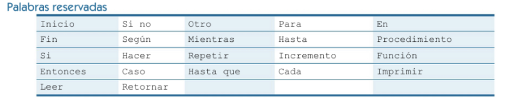

# 01 - Introducción a la programación.

### - [Datos, algoritmos y programas.](#uno)
### - [Paradigmas de programación.](#dos)
### - [Lenguajes de programación.](#tres)
### - [Herramientas y entornos para el desarrollo de programas](#cuatro)
### - [Errores y calidad de los programas.](#cinco)
### - [Fases en la creación y ejecución de un programa.](#seis)

<a name="uno"></a>
## Datos, algoritmos y programas.

### Introducción

Al iniciar cualquier aprendizaje debe conocer previamente de una serie de conceptos básicos. Para el caso del módulo que nos ocupa, debemos conocer los conceptos  programación, programa, algoritmo, fases de desarrollo  y tipos de programación.

La razón principal por la que utilizamos un ordenador es para resolver problemas (en el sentido más general de la palabra), que de manera manual serían costosos en tiempo y cuyo resultado no sería óptimo. Algunos de los problemas que nos puede resolver un ordenador son: procesamiento de texto, edición de fotografía, contabilidad, ... Cualquiera de estas tareas trabaja con una serie de datos de entrada y ofrece un resultado. Por lo tanto, un algoritmo se encargará de procesar una serie de datos de entrada para mostrar un conjunto de datos de salida.

### Breve historia de la programación
Antes de definir la programación, deberíamos tener claro qué es un ordenador. Lo podemos definir como una máquina que realiza el tratamiento de datos de forma automática.  Los ordenadores tienen sus raíces  en las primeras calculadoras de operaciones matemáticas elementales, las cuales incluían los algoritmos implementados dentro de su estructura física. Algunos de estos dispositivos son la calculadora mecánica de **Leibnitz** y la considerada primera computadora -la máquina analítica- de **Charles Babbage**.

La informática como disciplina es relativamente reciente. No se empezó a hablar de Ingeniería Informática hasta finales de los años 50. No obstante, en el pasado hubo aproximaciones por parte de los precursores de la programación tal y como la conocemos hoy, y que surgieron para dar respuesta a la necesidad de automatizar y facilitar las tareas que originalmente se realizaban de forma manual.

Por ejemplo, cuando comenzó la revolución industrial,  en los telares automáticos de la industria inglesa, se recibían los datos sobre el trabajo a realizar a través de tarjetas perforadas. Sin embargo, no es hasta la aportación de **Augusta Ada Byron** (considerada la primera programadora de la historia) que puede hablarse de programación como ciencia estructurada.

###  Algoritmo, programa y programación.
Ya sabemos qué es un ordenador. Pero el ordenador no es inteligente, solamente ejecutará las operaciones deseadas si previamente alguien lo ha preparado. Esta preparación se llama programación y tiene como resultado final el programa que, cuando es ejecutado por la máquina, permite conseguir el resultado que se pretendía.

Por **algoritmo** entendemos un conjunto ordenado de operaciones destinadas a resolver un problema que deben cumplir las siguientes condiciones:

- Tiene un número finito de pasos
- Acaba en un tiempo finito.
- Todas las operaciones están definidas de forma precisa y sin ambigüedades.
- Puede tener varios datos de entrada y como mínimo un dato de salida.

Un claro ejemplo de algoritmo es una receta de cocina, donde tenemos unos pasos que hay que seguir en un orden y deben de estar bien definidos, tiene un tiempo finito y tiene unos datos de entrada (ingredientes) y una salida (el plato).

Consideremos el típico ejemplo que se propone a todo estudiante de programación en su primera clase: Queremos enseñar a alguien (persona o máquina) cómo tiene que hacer una tortilla francesa de dos huevos. La receta podrá ser así:

**Requisitos:** un plato, un tenedor, una sartén, una fuente de calor(fuego) para cocinar.

**Datos de entrada**: Huevo, aceite, sal.

**Datos de salida**: huevo frito.

**Procedimiento**:

a) <u>Romper</u> los dos huevos en el plato y <u>desechar</u> la  cáscara.

b) <u>Echar</u> poco de sal sobre los huevos.

c) <u>Batir</u> los huevos con el tenedor.

d) <u>Echar</u> un chorro de aceite en la sartén y <u>calentar</u> en el fogón.

f) Cuando el aceite esté caliente, <u>verter</u> el contenido del plato en la sartén.

g) A medida que el huevo va cuajando, <u>plegar sobre sí misma</u> con la ayuda del tenedor.

h) <u>Sacar</u> la tortilla de la sartén cuando el huevo haya cuajado del todo.

i) <u>Apagar</u> el fuego.

j) <u>Recoger</u> y <u>limpiar</u>.

En subrayado podemos ver las acciones que podrían ser usadas en otras recetas de cocina (otro algoritmo).

Un **programa** es una secuencia de comandos, comprensibles para el ordenador, que permiten la realización de una tarea determinada. El algoritmo anterior no sería interpretable por alguien que no fuese humano y no comprendiese el castellano, deberíamos "traducir" ese conjunto de instrucciones a otro lenguaje que sea capaz de ser entendido por un ordenador. Otra característica es que el conjunto de instrucciones es limitado. En el ejemplo anterior, las acciones subrayadas formarían el lenguaje de programación para cocinar.

La **programación** es la secuencia de pasos que debe efectuar el programador para obtener un programa.

En el ejemplo anterior , hemos elaborado un programa que permite conseguir un objetivo final: hacer una tortilla francesa de dos huevos. La receta sería el resultado final -el programa- pero para llegar a escribirla correctamente, hemos tenido que seguir, en el orden siguiente:

1) Una fase de **análisis**, donde se piensa y se organizas al detalle todo lo que supone hacer una tortilla, podemos hacer uso de gráficos y herramientas específicas si es necesario. El análisis debe concluir si el problema es factible de ser resuelto por un algoritmo.
2) Una fase de **diseño**, ligando de manera adecuada todas las ideas y bocetos en la fase de análisis. Aquí se trata de organizar de manera adecuada todo lo anterior para llegar con ciertas garantías de éxito a la fase 3
3) Una fase de **escritura**, redactando de manera ordenada y clara la secuencia de pasos a seguir.

Las fases de desarrollo del software se estudiarán en la materia de "Entornos de desarrollo".

Todo lo anterior se ejecuta dentro de un sistema informático (PC, portátil ,...) que interpreta las instrucciones del lenguaje y las traduce a un lenguaje que puede interpretar (lenguaje máquina). 
Dependiendo del proceso de traducción del lenguaje de programación usado al lenguaje máquina, podemos clasificar las lenguajes en varios tipos.

> **Un ordenador es como una pizzería.**<br>Si se quiere hacer un símil con nuestro mundo diario, un ordenador es como la cocina de una pizzería que acepta pedidos telefónicos. Hacer un pedido equivale a pedir el inicio de la ejecución de un programa. Para llevar a cabo este pedido, será necesario manipular una serie de ingredientes, que representarían los datos. El cocinero con sus utensilios (horno, amasador, etc.) serían el procesador, ya que manipulan y transforman los ingredientes. La nevera, los armarios o los contenedores, de donde el cocinero puede sacar ingredientes o donde puede guardarlos mientras no los está manipulando, representarían la memoria. El sistema de entrada/salida serían los elementos de comunicación con el exterior de la pizzería, como el motorista que lleva la pizza o el teléfono que el cocinero puede utilizar para pedir que le traigan nuevos ingredientes cuando se le acaben, pedir información adicional al usuario (“Se acabó el pimiento, ¿va bien si ponemos cebolla?”), o avisarle de algún evento (“Lo siento, tardará un poco más de lo previsto”). De hecho, continuando con el símil, el cocinero prepara una pizza siguiendo un conjunto de pasos. En este caso la receta son las órdenes que debe seguir el programa. Y si el cocinero no tiene la receta no puede realizar el pedido.

### Tratamiento de los datos
El propósito principal de todo programa de ordenador, en última instancia, es procesar datos de todo tipo. Para lograr esta tarea, el ordenador debe almacenar los datos en la memoria, de forma que posteriormente el procesador pueda leerlos y transformarlos de acuerdo con los propósitos del programa. 

Por tanto, un buen lugar por donde empezar el aprendizaje de  programación es entender claramente el  conjunto de instrucciones que da a la memoria las órdenes de guardar o consultar los datos que se van a necesitar en cada momento. 

Una vez que ya se saben gestionar datos en la memoria, es el momento de ver algunas de las transformaciones básicas que permite realizar el procesador.

El término **dato** indica toda información que utiliza el ordenador en las ejecuciones de los programas.

Aunque en ocasiones se usa el término datos, en plural, como si fuera algo en general, hay que tener en cuenta que dentro de un programa cada dato que se quiere tratar es un elemento individual e independiente. Por ejemplo, en un programa que suma dos números cualesquiera existen tres datos con los que trabaja: los dos operandos iniciales y el resultado final.

Por otra parte, hasta el momento se ha dicho que el ordenador se encarga de procesar y transformar cada uno de estos datos individuales, pero tampoco se ha especificado exactamente cómo se representan o clasifican los diferentes tipos de datos dentro del programa, o cómo se pueden transformar. Ha llegado el momento de concretar algo más todos estos detalles.

<a name="dos"></a>
## Paradigmas de programación

Un paradigma de programación no es más que un acuerdo entre la comunidad de desarrollo de software para aceptar como modelo de referencia para generar un código de calidad, un conjunto de recomendaciones y normas a la hora de programar.

Normalmente, en la vida real los programadores suelen mezclar costumbres o métodos de  varios de ellos al mismo tiempo para el desarrollo de sus programas, lo que se denomina programación multiparadigma y generalmente es la forma que mejores resultados obtiene.

Utilizar un paradigma de programación, aceptando y siguiendo sus reglas, derivará en un código fuente fácil de mantener, entender y corregir.
Son muchos los paradigmas de programación que se pueden enumerar, aunque a continuación serán descritos con detalle aquellos más empleados
que mayor relación guardan con los contenidos del curso. 

Los dos paradigmas que vamos a ver en este tema son:
- La programación estructurada
- Paradigma de programación modular. 

Para una completa información se recomienda leer el siguiente enlace:

[Paradigmas de Programación](https://sites.google.com/site/programacionmodularbycentecon/home)

El paradigma de programación orientada a objetos será estudiado en otro tema diferente.

<a name="tres"></a>
## Lenguajes de programación.
Como hemos visto previamente, los lenguajes de programación serán los encargados de procesar una serie de datos de entrada a través de una serie de instrucciones organizadas de manera coherente y siguiendo unos patrones prefijados.

A continuación vamos a tratar los datos y las estructuras de código que forman parte de la mayoría de lenguajes de programación estructurados, que es el paradigma que vamos a desarrollar en este curso.

### Tipo de datos
Estrictamente hablando, cualquier información puede transformarse en datos que pueda entender y manipular un ordenador. Un dato individual dentro de su programa puede ser un documento de texto, una imagen, un plano de un edificio, una canción, etc... 

Basta con ver la inmensa variedad de programas que existen hoy en día para hacerse una idea. Ahora bien, uno de los puntos importantes es que dentro de un programa los datos pueden clasificarse dentro de diferentes categorías, los tipos de datos.

>Un **tipo de dato** es la definición del conjunto de valores válidos que pueden tomar unos datos y el conjunto de transformaciones que se pueden realizar.

Por ejemplo, en su día a día a menudo trata con datos que tienen como característica común el hecho de que se pueden representar mediante números: una distancia, una edad, un período de tiempo, etc. Puede decirse que una ciudad está a 8 km de otra, que alguien tiene 30 años o que han pasado 15 días desde un evento. Por tanto, los valores 8, 30 o 15 formarían parte de un mismo tipo de dato.

También como ejemplo, en contraposición a los datos de tipo numérico, otra información que trata habitualmente es texto en palabras: el nombre de una mascota, de una calle, de una institución, etc. En este caso, puede estar hablando de “Tarzán”, de la “Plaza de España”, del “IES Los Albares”, etc. En este caso, los datos se representan con distintos símbolos y expresan otras ideas. Por tanto, formarían parte de otro tipo de dato.

Una propiedad importante para ver si dos datos son de distintos tipos es si el conjunto de valores con el que se pueden expresar también es diferente. En los dos ejemplos anteriores, la consideración de que se trata de tipos de datos diferentes también se encuentra soportada por este hecho. Por ejemplo, el conjunto de valores que puede tomar el nombre de una calle o una persona no es cualquiera, ya que no puede expresarse exclusivamente mediante valores numéricos.

Como cada dato dentro de su programa siempre debe pertenecer a algún tipo, precisamente parte de su tarea como programadores es identificar cuál es el tipo que se acerca más a la información que desea representar y procesar. Establecer cuál es el tipo de un dato implica que se establecen un conjunto de condiciones sobre ese dato a lo largo de todo el programa. Una de las más importantes es el efecto sobre la forma en que este dato se representará, tanto internamente dentro del hardware del ordenador como a la hora de representarlo en el código fuente de sus programas. Recuerde que, por su naturaleza de sistema digital, todos los datos que hay dentro de un ordenador se codifican como secuencias binarias. Qué secuencia de 0 y 1 es necesario usar para representar el valor de cada dato dependerá del tipo escogido.

Cada lenguaje de programación incorpora sus propios tipos de datos y, aparte, casi siempre ofrece mecanismos para definir otros tipos partiendo de tipos de datos ya existentes. Por tanto, como programadores, sólo tiene que elegir entre todos los que ofrece el lenguaje cuál se acerca más al tipo de información que desea tratar. Sin embargo, desgraciadamente no se puede garantizar que las instrucciones básicas definidas en la sintaxis de un lenguaje de programación sean capaces de tratar de manera directa cualquier dato. Esto sólo sucede con un conjunto limitado de tipos de datos muy simples, llamados tipos primitivos.

> Los **tipos de datos primitivos** son los que ya están incorporados directamente dentro de un lenguaje de programación, y son usados como piezas básicas para construir otros complejos.

El soporte a diferentes tipos primitivos puede variar también entre lenguajes. De todas formas, hay cuatro que se puede considerar que, de una u otra manera, todos los lenguajes los soportan. El motivo es que estos tipos están estrechamente ligados a los tipos de secuencias binarias que normalmente un ordenador puede procesar y representar directamente dentro de su hardware. Se trata de **números enteros, reales, caracteres y booleanos**.

> Los lenguajes de programación identifican cada tipo con una palabra clave propia.

Para empezar, basta con ver qué tipo de datos representan. Ahora bien, para ilustrar cómo podemos usar dentro del código fuente de un programa datos que pertenecen a tipos primitivos, empezará trabajando con literales.

> Un **literal** es un texto usado para representar un valor fijo en el código fuente de un programa.

#### El tipo de dato booleano

El tipo de dato booleano representa un valor de tipo lógico a fin de establecer la certeza o falsedad de un estado o afirmación.

-  Ejemplos de literales de un dato booleano: true (cierto) o false (falso). No hay otro.
- Ejemplos de datos que suelen representarse con un booleano: interruptor encendido o apagado, estar casado, tener derecho de voto, disponer de carnet de conducir B1, número acertado, etc.

> La palabra clave para identificar este tipo de datos en Java es **boolean**.

#### El tipo de dato entero

El tipo de dato entero representa un valor numérico, positivo o negativo, sin ningún decimal.

- Ejemplos de literales enteros: 3, 0, -345, 138764, -345002, etc.
- Ejemplos de datos que suelen representarse con un entero: edad, día del mes, año, número de hijos, etc.

Un literal de tipo entero se representa simplemente escribiendo un número sin decimales.

> La palabra clave para identificar este tipo de dato en Java es **int**.

#### El tipo de dato real

El tipo de dato real representa un valor numérico, positivo o negativo, con decimales.

La palabra clave para identificar este tipo de dato en Java es double.

- Ejemplos de literales reales: 2.25, 4.0, -9653.3333, 100.0003, etc.
- Ejemplos de datos que suelen representarse con un real: un precio en euros, el récord mundial de los 100 m lisos, la distancia entre dos ciudades, etc.

Para referirse a un dato de tipo real, éste incluye siempre sus decimales con un punto (.). En los ejemplos vemos el valor 4.0. Los números reales representan valores numéricos con decimales, pero en su definición nada impide que el decimal sea 0. Por tanto, estrictamente, el valor 4 y el valor 4.0 corresponden a tipos de datos diferentes. El primero es un valor para un tipo de dato entero y el segundo para uno real.

El hecho de usar el punto para separar los decimales viene por el sistema numérico americano, diferente al nuestro.

Una pregunta que quizás se puede plantear ahora es qué sentido tiene el tipo entero si con el tipo real ya podemos representar cualquier número, con decimales incluso. ¿No es algo redundante? Bien, de entrada puede parecer que sí, pero hay un motivo para diferenciarlos. Sin entrar en detalles muy técnicos, representar y realizar operaciones con enteros internamente dentro del ordenador (en binario) es mucho más sencillo y rápido que con reales. Además, un entero requiere menos memoria. Evidentemente, un programa no será perceptiblemente más lento o más rápido por el simple hecho de realizar una operación entre dos datos de tipo real en lugar de entero, pero es una buena costumbre usar siempre el tipo de dato que se adapte exactamente a nuestras necesidades. Si un dato no tiene sentido que tenga decimales, como un número de año o mes, es mejor usar el tipo entero.

#### El tipo de dato carácter

El tipo de dato carácter representa una unidad fundamental de texto usada en cualquier alfabeto, número o signo de puntuación o exclamación.

- Ejemplos de literales carácter: 'a', 'A', '4', '>', '?', 'Γ' (letra griega gamma mayúscula), etc.
- Ejemplos de datos que suelen representarse con un carácter: cada uno de los símbolos individuales de un alfabeto.

> La palabra clave para identificar este tipo de dato en Java es **char**.

Para referirse a un dato de tipo carácter, éste se rodea de comillas simples ('). Por tanto, no es lo mismo el carácter ‘4’ y que el valor entero 4, ya que pertenecen a tipos diferentes. El primero lo usará para referirse a una representación textual, mientras que el segundo es el concepto propiamente matemático. 

En Java, hay que tener especial cuidado con el uso de comillas simples -'- o dobles -"-, ya que entre las comillas simples sólo puede haber un solo carácter, o el intérprete dirá que la sintaxis no es correcta.

> **Sistemas de representación de los caracteres**<br>
 A la hora de decidir cómo se representa internamente un carácter, se utilizan diferentes tablas de códigos establecidos, entre los que destacan los códigos **ASCII** y **UNICODE**.<br>
 El código **ASCII** fue uno de los más extendidos, sobre todo por la gran proliferación de ordenadores personales (llamados en inglés personal computer, PC). <br>
El código **ASCII** inicial representaba 128 caracteres en lugar de 256. Cuando se necesitaron caracteres especiales para los distintos idiomas, se amplió con 128 caracteres más, constituyéndose el código **ASCII extendido**.<br>
Desgraciadamente, el código **ASCII** tiene un inconveniente, y es que sólo permite representar alfabetos occidentales, por lo que los programas que lo usan para representar sus datos de tipo carácter son incompatibles con sistemas con otros alfabetos, como todos los asiáticos, el cirílico, etc. <br>
Por este motivo, posteriormente se creó la tabla de codificación **UNICODE**, que permite codificar hasta 65.536 caracteres, pero manteniendo la compatibilidad con la codificación ASCII. Esto permite dar soporte a cualquier lengua actual, e incluso antiguas, como los jeroglíficos egipcios. Este sistema es el que actualmente utilizan la mayoría de aplicaciones modernas.

### Estructuras de control
Tal como se ha comentado en el apartado anterior, el pseudocódigo utiliza las estructuras de control propias de la programación estructurada. Por este motivo se emplearán secuencias que representen las estructuras de control secuencial, alternativa e iterativa.

#### Estructuras de control secuencial
Describen bloques de instrucciones que son ejecutadas en orden de aparición (secuencialmente). Los bloques pueden estar delimitados por las expresiones Inicio-Fin o bien estar contenidos en otras estructuras. 

```
Inicio 
   <instrucción1>
   ...
   <instrucciónN> 
Fin
```

#### Estructuras de control alternativa
Entre los diferentes tipos de estructuras de control que permiten establecer el flujo de control de un programa, las más fáciles de entender son aquellas que crean bifurcaciones o caminos alternativos, de forma que, según las circunstancias, se ejecute un conjunto de instrucciones u otro. De esta forma, dadas diferentes ejecuciones de un mismo código fuente, parte de las instrucciones que se ejecutan pueden ser diferentes para cada caso.

Las estructuras de selección permiten tomar decisiones sobre qué conjunto de instrucciones se deben ejecutar en un punto del programa. O sea, seleccionar qué código se ejecuta en un momento determinado entre caminos alternativos.

Toda estructura de selección se basa en la evaluación de una expresión que debe dar un resultado booleano: true (cierto) o false (falso). Esta expresión se llama la condición lógica de la estructura.

```
Si (condición) entonces 
   <instrucción1>
   ...
   <instrucciónX> 
Fin Si
```

El conjunto de instrucciones que se ejecutará dependerá del resultado de la condición lógica, actuando como una especie de interruptor que marca el flujo a seguir dentro del programa. Normalmente, esta condición lógica se basa en parte, o en su totalidad, en valores almacenados en variables cuyo valor puede ser diferente para diferentes ejecuciones del programa. 

**Dos caminos alternativos: la sentencia ''if/lese''**

Supongamos que ahora queremos realizar un programa en el que se debe intentar adivinar un número entre 1 y 10. En este caso, y a diferencia del anterior, ahora hay dos escenarios excluyentes: o se ha adivinado el número, o no se ha adivinado. Según el caso que se trate, la respuesta del programa debe ser diferente. Por tanto, además del código común para cualquier caso y de un bloque que especifique las acciones para llevar a cabo si se cumple la condición, ahora es necesario otro que indique qué hacer sólo en caso contrario. Para poder hacer esto tenemos la estructura de selección doble, la sentencia if/lese (si… si no…).

```
Si (condición) entonces 
   <instrucciones1> 
SiNo
   <instrucciones2> 
FinSi
```

La estructura de selección doble permite controlar que se ejecute un conjunto de instrucciones, sólo si se cumple la condición lógica, y que se ejecute otro, sólo si no se cumple la condición lógica

Es importante recordar que ambos bloques de código son excluyentes. Nunca puede ocurrir que ambos se acaben ejecutando.

**Varios caminos: la sentencia ''if/else if/else''**
Finalmente, a la hora de establecer el flujo de control de un programa, también existe la posibilidad de que haya un número arbitrario de caminos alternativos, no sólo dos. Por ejemplo, imagináis un programa que, a partir de la nota numérica de un examen, debe establecer cuál es la calificación del alumno. Por eso habrá que ver dentro de qué rango se encuentra el número. En cualquier caso, los posibles resultados son más de dos.

```shell
Si (condición) entonces 
   <instrucciones1> 
SiNo SI
   <instrucciones2> 
SiNo SI
   <instrucciones3> 
SiNo SI
   <instrucciones4> 
   ...
FinSi
```

El resto de estructuras de control (elección múltiple, bucles y secuencias iterativas) las veremos en otra unidad.

### PSEUDOCÓDIGO
El pseudocódigo es un lenguaje cercano a un lenguaje de programación cuyo objetivo es el desarrollo de algoritmos fácilmente interpretable por un programador, independientemente del lenguaje de programación del que provenga. En sí mismo no se trata de un lenguaje de programación, pero si que utiliza un conjunto limitado de expresiones que permiten representar las estructuras de control y los módulos descritos en los paradigmas de programación estructurada y modular.

Mediante pseudocódigo se puede escribir aquellos algoritmos que tengan solución finita y que comiencen desde un único punto de partida. La escritura de un algoritmo programa en pseudocódigo debería favorecer la posterior traducción al lenguaje de programación elegido.

> Dado que no existe una sintaxis estandarizada para la escritura de pseudocódigo, es posible encontrar diferencias sustanciales en los pseudocódigos escritos por diferentes programadores.

### Operadores y palabras reservadas

A pesar de que no existe una norma rígida que establezca cómo realizar la escritura de programas en pseudocódigo, es recomendable seguir una serie de recomendaciones que permitan transcribir el programa al lenguaje de programación que va a usarse con la mayor facilidad. A continuación, se muestran las tablas resumen de los operadores, palabras reservadas y tipos de datos empleados para la escritura de pseudocódigo en el capítulo.





<a name="cuatro"></a>
## Herramientas y entornos para el desarrollo de programas.
Existen multitud de herramientas para desarrollar nuestros programas, para profundizar en este apartado, se recomienda leer el [apartado correspondiente]() de la unidad 2 de entornos de desarrollo.

<a name="cinco"></a>
## Errores y calidad de los programas.
Ver [Referencia en Entornos de Desarrollo](https://github.com/joaquinalbares/entornos2223/blob/master/UT01/UT01.md#errores-en-el-desarrollo-de-programas)

### Errores comunes en JAVA

Aunque todavía no hemos entrado en el lenguaje JAVA, podemos introducir aquí algunos errores comunes, aunque hay otros muchos más. 


#### PROBLEMAS LÉXICOS 
**Mayúsculas y minúsculas**

Java es sensible a las mayúsculas y las minúsculas. De esta manera, si defines una variable con el nombre myVar y la utilizas como myvar, en realidad te estás refiriendo a una variable diferente. El tipo de datos (tipos primitivos) comienzan con letra minúscula y los nombres de las clases con letra mayúscula. Por lo tanto, tienes que tener cuidado a la hora de escribir int e Integer. Ten cuidado también cuando escribas String y no string porque String, aunque es muy básica, también es una clase. Fíjate en que el nombre de la clase comienza con una letra mayúscula, pero la palabra clave class es con letra minúscula.

**Corchetes**

Hay varios tipos de corchetes: los paréntesis(),los paréntesis cuadrados[],las llaves{}. Tienen que ser utilizados de forma correcta. Esto significa que no debes olvidar cerrarlos cuando los hayas abierto y, además, hacerlo en el orden correcto. Quizá el error más común sea olvidar cerrar un corchete, por ejemplo: cerrar } al final de la definición de una clase.

Las comillas simples y dobles también tienen el comportamiento de los paréntesis con la salvedad de que, en este caso, los símbolos para abrir y cerrar son los mismos. Con las comillas también hay que tener cuidado para no incluir una nueva línea en un string. Por ejemplo,

```java
String s = "A loooooooooooooooong
string"
```

es incorrecto. En vez de eso, quizá querías escribir 

`String s = "A loooooooooooooooong string"`

o también

```java
String s = "A loooooooooooooooong " +
"string"
```

**Operadores**

Tienes que comprender bien la forma y la función de los diferentes operadores en Java. Por ejemplo, tienes que distinguir la asignación = de la comparación de igualdad  ==.

`x=3`

asigna 3 a x, mientras

`x==3`

comprueba si el valor de x es igual a 3.

Sin embargo, puedes utilizar == solo para la comparación de valores de tipos sencillos o escalares, pero no para objetos.

`3==3`

devuelve true, mientras

`"3"=="3"`

puede que no. Como el String es un objetos, estamos comprobando si la posición de la representación interna de estos objetos es la misma y no si los objetos son iguales. Para comparar los objetos a y b, puedes utilizar el método equals()

`a.equals(b)`

#### DECLARACIÓN Y USO
**Arrays y Paquetes**

Un error común es intentar utilizar una clase en nuestros programas sin importar los paquetes requeridos.
Por ejemplo, si queremos utilizar una instancia de la clase Vector debemos importar siempre el paquete java.util.

Pero, ¿por qué podemos utilizar la clase String sin importar ningún paquete?  La clase String pertenece al paquete java.lang y este paquete es el único que se importa automáticamente (por lo que podemos utilizar clases como String o Integer sin importar el paquete java.lang.) 

En relación al uso de los arrays de dos dimensiones, los programadores novatos tienden a asumir que los arrays bidimensionales están implementados directamente en Java. Por lo tanto, un error común es escribir:

`int[,] array = new int[2,5];`

En Java tenemos que crear las filas en primer lugar y, después, las columnas. Los arrays bidimensionales son dos arrays unidimensionales que contiene cada uno una dimensión diferente. Por lo tanto, la sentencia previa debería haber sido escrita de la siguiente manera:

```java
int[][] array = new int[2][];
array[0] = new int[5];
array[1] = new int[5];
```


O de esta manera más corta:

`int[][] array = new int[2][5];`

FUENTE: [Introducción a la programación en Java: escribiendo buen código - edX](https://learning.edx.org/course/course-v1:UC3Mx+IT.1.2-ESx+3T2022/block-v1:UC3Mx+IT.1.2-ESx+3T2022+type@sequential+block@b495be1968bc45359d22416edd55ad39/block-v1:UC3Mx+IT.1.2-ESx+3T2022+type@vertical+block@22647d456314421db8bf63424091bc81)

<a name="seis"></a>
## Fases en la creación y ejecución de un programa.
Ver [Referencia en Entornos de Desarrollo](https://github.com/joaquinalbares/entornos2223/blob/master/UT01/UT01.md#errores-en-el-desarrollo-de-programas)


## FUENTES:
- [l'Institut Obert de Catalunya](https://ioc.xtec.cat/materials/FP/Recursos/fp_asx_m03_/web/fp_asx_m03_htmlindex/WebContent/u1/a2/continguts.html)
- [PROGRAMACIÓN (ED. SÍNTESIS)](https://www.sintesis.com/desarrollo%20de%20aplicaciones%20multiplataforma-341/programaci%C3%B3n-ebook-2653.html)
- [Ejercicios DAM](https://gradosuperiordam.top/asignaturas/programacion/)


