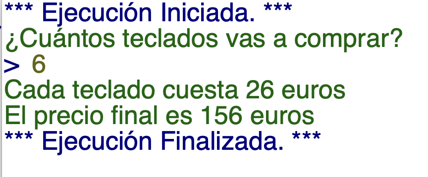
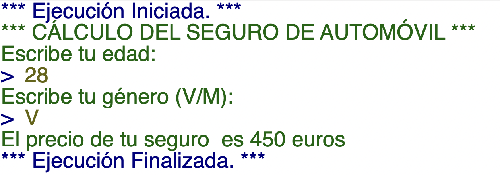
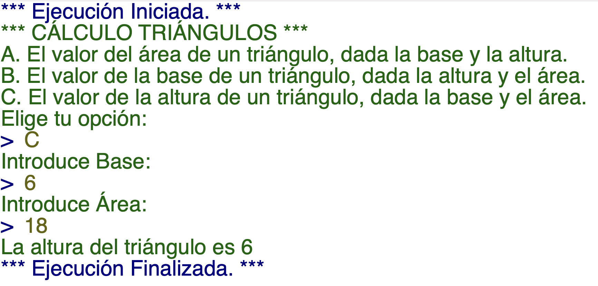
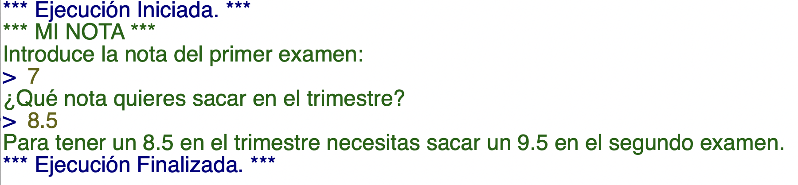
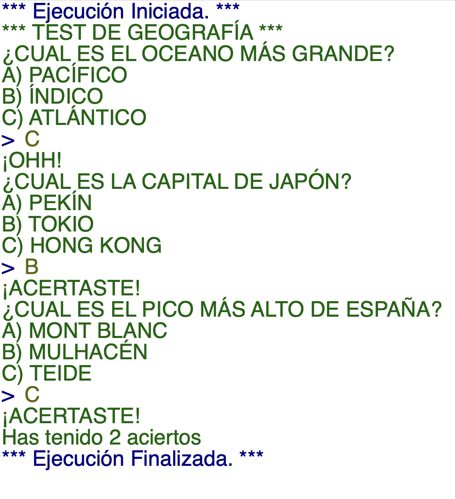

# BOLETÍN 03
#### (SUBIR A GITHUB) . FECHA TOPE: 17-12-203

## Ejercicio 01
En una tienda de informática, hay una promoción en la venta de teclados:

- Si se compran más de 8 el precio de cada teclado es de 20€
- Si se compran entre 4 y 8 el precio de cada teclado es de 26€
- Si se compran menos de 4 el precio es de 30€ cada uno.

Escribe el algoritmo para saber cuanto pagará un cliente según el número de teclados que compra. Mostrar el número de teclados a comprar y el total a pagar.

EJEMPLO:



## Ejercicio 02
Escribe un algoritmo que calcule el precio del seguro de automóvil de una persona dependiendo de unos determinados parámetros.

La aplicación recibirá los siguientes datos:

- Edad (número)
- Género (V o M) 

Y devolverá el precio del seguro dependiendo de las siguientes condiciones:

- Los hombres menores de 30 años pagan 450€.
- Los hombres entre 31 y 50 años pagan 400€.
- Los hombres mayores de 50 años pagan 350€.
- Las mujeres menores de 25 años pagan 400€.
- Las mujeres mayores de 25 años pagan 350€.

EJEMPLO:


## Ejercicio 03 
Escribe un algoritmo que muestre por pantalla los siguientes mensajes:

```shell
A. El valor del área de un triángulo, dada la base y la altura.
B. El valor de la base de un triángulo, dada la altura y el área.
C. El valor de la altura de un triángulo, dada la base y el área.
```

El usuario escribirá la letra correspondiente y dependiendo de la opción, se pedirán los valores pertinentes y se mostrará el resultado por pantalla.

EJEMPLO:


## Ejercicio 04 
En la asignatura de sistemas, la nota se calcula en base a dos pruebas con el siguiente coeficiente:

- 40% - Prueba 1
- 60% - Prueba 2

Escribe un algoritmo que calcule la nota que hace falta sacar en la segunda prueba para obtener la media deseada. 

EJEMPLO:



## Ejercicio 05
Realiza un algoritmo que simule un test de tres preguntas tipo test, donde el usuario deberá escribir la letra de la opción elegida y se mostrará si ha acertado la pregunta.

Al finalizar el programa deberá mostrar el número de aciertos totales.

EJEMPLO:



